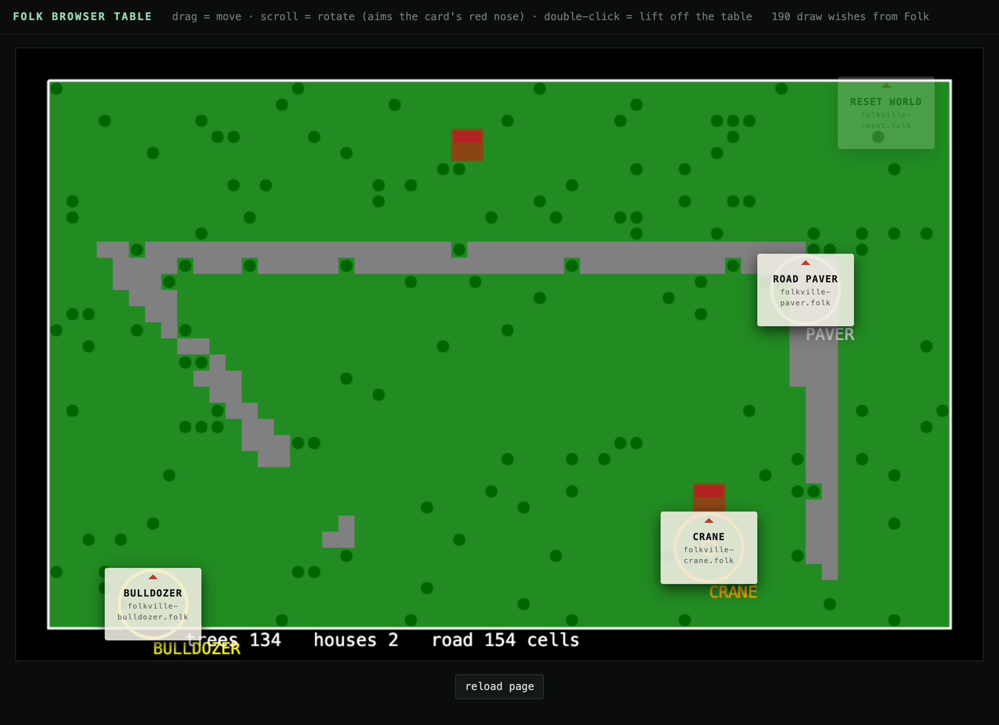
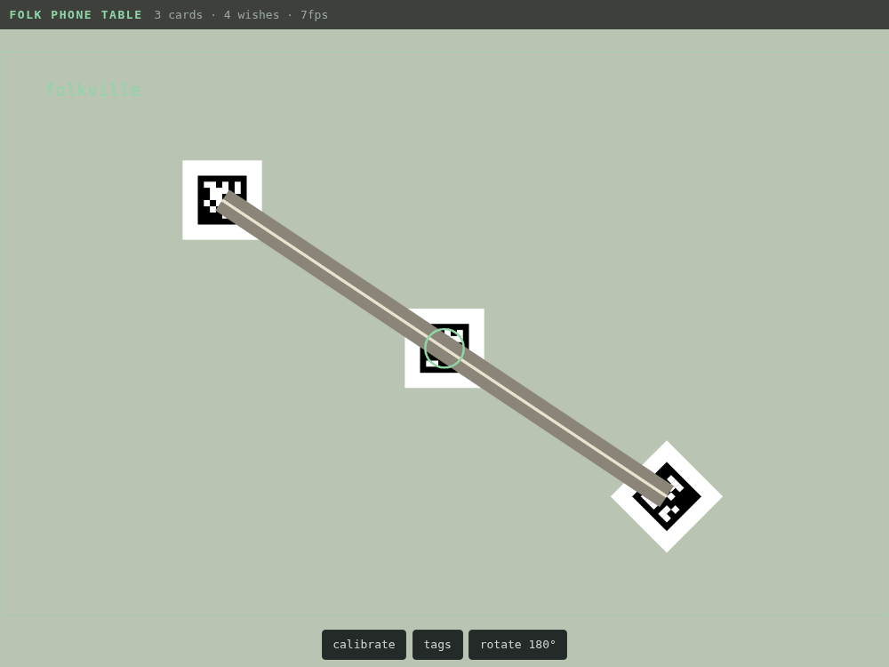

# browser-table — run a Folk app without a table



A Folk table in a browser tab: real Folk, no camera, no projector, no printer,
no LEGO. You drag paper cards around with the mouse and the app responds
exactly as it would on hardware.

There are two table clients. The **mouse table** (`/`) fakes the physical world
entirely: cards are divs you drag. The **[phone table](#phone-table--a-phone-as-camera-and-projector)**
(`/phone`) plays with the real physical world: printed cards on a real surface,
a phone mounted overhead as the camera, its screen (mirrored to a TV) as the
projector.

This is **not** a simulator. The Folk binary from
[FolkComputer/folk](https://github.com/FolkComputer/folk) runs the real
statement database, the real pattern matcher, real `When` / `Hold!` / `Query!`,
and your app's programs, unmodified. Only the hardware is stood in for:

| hardware | stand-in |
| --- | --- |
| projector | `Assert! display "web" has width … height …` |
| camera + AprilTags | mouse drags become `Claim <program> has quad {…}` in display space |
| Vulkan renderer | draw wishes are read out of the db and painted on a `<canvas>` |

Each card's own program still supplies its own claims
(`Claim $this is a folkville tool with kind paver`), so the app's joins against
card quads are the real joins.

Nothing here is app-specific — see the manifest below. The screenshot happens
to be [folkville](../folkville).

## Run it

You need a built Folk. An app that only draws needs no GPU or camera, so a
plain `make folk` is enough; none of the `builtin-programs` are loaded.

```sh
git clone https://github.com/FolkComputer/folk
cd folk
make deps
make folk                       # on macOS, if ld can't find -lssl:
                                #   make folk CFLAGS="-L$(brew --prefix openssl@3)/lib -I$(brew --prefix openssl@3)/include"
```

Then, from this repo:

```sh
export FOLK_TABLE=$PWD/folkville/browser-table.tcl
python3 browser-table/server.py &
cd /path/to/folk && ./folk /path/to/browser-table/harness.folk
```

Open <http://localhost:4274>.

- **drag** a card — moves it; folkville's paver lays continuous road
- **scroll** over a card — rotates it; the red nose is the card's "up"
- **double-click** a card — lifts it off the table (that's how you show a card
  that starts off, and how you clear others out of the way)

## The manifest

`$FOLK_TABLE` points at a file describing one app's table. Both `harness.folk`
(which sources it as Tcl) and `server.py` (which parses the same lines) read
it, so the card list lives in one place. Paths are relative to the manifest.

```tcl
display 1200 760                 ;# the virtual display size, in pixels

program folkville.folk           ;# load this program

#    kind    label          program              x    y   [off]
card paver  "ROAD PAVER"   folkville-paver.folk 400  600
card reset  "RESET WORLD"  folkville-reset.folk 1080  80  off
```

`card` also loads its program. `kind` is the browser's handle for the card;
`x y` is where it starts on the table; `off` starts it off the table.
Cards are 120×90 px.

To bring up a different app, write it a manifest — nothing in this directory
needs to change.

## phone-table — a phone as camera and projector



For testing gameplay with *actual objects* when you have no projector and no
mountable external camera: mount a phone looking down at a table, put printed
cards on it, and mirror the phone's screen to a TV. The computer still runs
Folk and `server.py` as the host; the phone is just a browser tab on the same
Wi‑Fi. `harness.folk` and `bridge.folk` are untouched — the phone is a second
client of the same server that happens to be a real camera:

| hardware | mouse table | phone table |
| --- | --- | --- |
| camera + AprilTags | mouse drags | real AprilTags, detected in JS from the phone camera |
| projector | a `<canvas>` | draw wishes painted over the live camera video, mirrored to a TV |

No WebXR, 8th Wall, ARKit or native app: a rigidly mounted phone is not an
AR-tracking problem, it's a webcam. Detection is plain fiducial CV in the
browser (vendored [js-aruco2](https://github.com/damianofalcioni/js-aruco2),
MIT) using the **tag36h11 family — the same tags real Folk uses**, so the cards
you print here would also be recognized by a real Folk table. The card's tag id
is its index in the manifest (first `card` line = tag 0, …).

### Run it

1. Start Folk and `server.py` as above. The server now also listens on
   HTTPS port 4275 (self-signed) and prints its LAN address — iOS refuses
   camera access to plain-HTTP origins, so the phone must use `https://`.
2. Open `http://localhost:4274/tags`, print at 100%, cut out the cards.
3. On the phone: `https://<computer-ip>:4275/phone`, accept the certificate
   warning once, tap **start camera**. Mount the phone facing down — a cheap
   gooseneck clamp works. Screen-mirror the phone to the TV via AirPlay.
4. Lay the four **corner tags** where the table's corners should be and tap
   **calibrate**; when all four are seen, the mapping locks in (saved on the
   phone) and you can remove them. Skip this and it assumes the camera frame
   is a straight-down view of the whole table.

### Calibration, the Folk way

Real Folk calibrates by detecting AprilTags at known display positions and
solving the camera↔projector homography. The phone can't run Folk's literal
calibrate code (there is no projector to flash patterns, and in browser-table
the Folk process deliberately has no camera), but it solves the *same* problem
with the same math: four printed corner tags at known table positions → DLT →
a camera→display plane homography. Every detected card is mapped through it,
so a tilted, keystoned phone mount still yields correct display-space quads,
and `bridge.folk` receives exactly what `tags-to-quads.folk` would produce.
No device intrinsics, no ARKit — raw camera pixels and fiducials, like Folk.

What it adds to the not-covered list: phone lens distortion is not corrected
(positions drift a few px at the frame edges), and a hand over a card occludes
its tag — positions freeze for ~1.2s before the card counts as lifted off,
which is what a real Folk table experiences too.

## Things that bite

These cost real debugging time. They are properties of Folk, not of this
harness, and they apply on hardware too.

**Folk does not print program errors.** It files them as statements. A program
that "does nothing" has usually thrown. `bridge.folk` polls
`/p/ has error /err/ with info /info/` and prints anything new to stderr — that
is how the `max()` bug below was found, after a lot of wrong guesses.

**Folk runs Jim Tcl, not tclsh.** Jim's `expr` has no `max()` or `min()`. A
throw inside a program's long-running loop kills the loop permanently, and if
other `When` handlers keep drawing, the app looks alive while its state is
frozen.

**A program body is not the global scope.** Its variables are locals of the
body, so `global foo` inside a proc the program defines does not see them; use
`upvar`.

**A `When` body runs in a fresh interpreter.** It cannot see the enclosing
program's procs or variables. Pass what it needs in the pattern (this is why
`harness.folk` claims the card map instead of `bridge.folk` reading a
variable), or define helpers inside the body.

**Publish quads the way `tags-to-quads.folk` does** — as plain `Claim`s inside
a `When` body that re-runs when positions change, so they retract themselves.
Holding a separate `Hold! -key` per card at drag rate churns the db hard enough
to disrupt other programs.

**Keep the main thread idle.** Running a poll loop in the top-level script
wedges the evaluator; a long-running program loop stops after a handful of
ticks. Load the loop as a program (`bridge.folk`) and let `harness.folk` sleep.

## What it does not cover

Tag detection and pose estimation, camera jitter and lighting, projector
calibration and keystone, physical card size versus distances the app assumes,
the GPU draw path (`Wish to draw a polygon` is read here, not rendered by
Folk's own renderer), and printing. Those still need the real table.

## Files

| file | |
| --- | --- |
| `harness.folk` | reads the manifest, loads the app + bridge, asserts the virtual display, keeps the main thread idle |
| `bridge.folk` | card positions → quad claims; draw wishes → scene JSON; prints program errors |
| `server.py` | serves the pages (HTTP + HTTPS), exposes the manifest as `/table.json`, mediates the two JSON files |
| `table.html` | the mouse table: draggable cards over a canvas |
| `phone.html` | the phone table: camera → tag detection → homography → card positions; draw wishes over live video |
| `tags.html` | printable tag36h11 cards + calibration corner tags |
| `vendor/` | js-aruco2 (MIT) + the AprilTag 36h11 dictionary (BSD, U. Michigan) |
| `test/` | end-to-end phone-table test, no camera needed: synthesizes photos of tags, runs them through `/phone`, asserts on what reaches Folk (`cd test && npm i playwright-core && node test.mjs`) |
