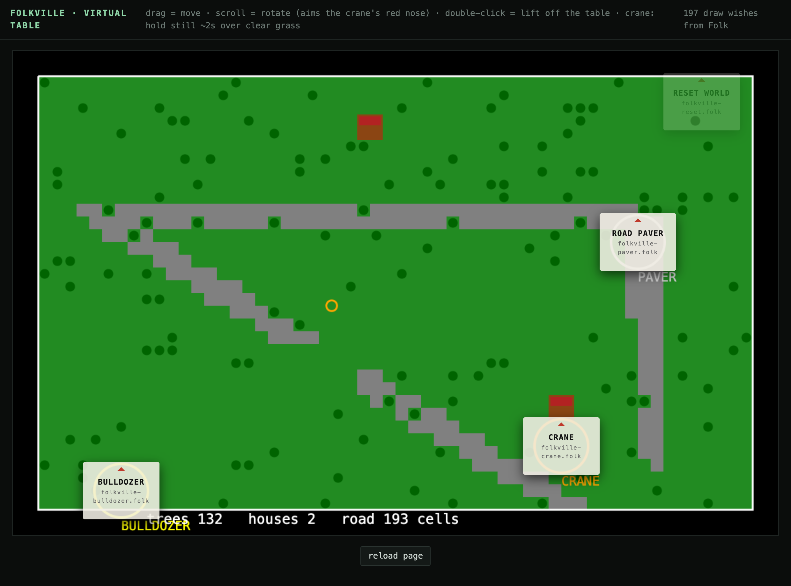

# dev-table — play folkville without a table



A virtual Folk table: real Folk, no camera, no projector, no printer, no LEGO.
You drag paper cards around with the mouse and the game responds exactly as it
would on hardware.

This is **not** a simulator. The Folk binary from
[FolkComputer/folk](https://github.com/FolkComputer/folk) runs the real
statement database, the real pattern matcher, real `When` / `Hold!` / `Query!`,
and the real `folkville/*.folk` programs, unmodified. Only the hardware is
stood in for:

| hardware | stand-in |
| --- | --- |
| projector | `Assert! display "web" has width 1200 height 760` |
| camera + AprilTags | mouse drags become `Claim <card>.folk has quad {…}` in display space |
| Vulkan renderer | draw wishes are read out of the db and painted on a `<canvas>` |

The tool cards' own programs still supply
`Claim $this is a folkville tool with kind paver`, so the engine's tool join is
the real join against real quads.

## Run it

You need a built Folk. Folkville needs no GPU or camera, so a plain
`make folk` is enough — none of the `builtin-programs` are loaded.

```sh
git clone https://github.com/FolkComputer/folk
cd folk
make deps
make folk                       # on macOS, if ld can't find -lssl:
                                #   make folk CFLAGS="-L$(brew --prefix openssl@3)/lib -I$(brew --prefix openssl@3)/include"
```

Then, from this repo:

```sh
python3 dev-table/server.py &                       # serves the page on :4274
cd /path/to/folk && ./folk /path/to/dev-table/harness.folk
```

Open <http://localhost:4274>.

- **drag** a card — moves the vehicle; the paver lays continuous road
- **scroll** over a card — rotates it; the red nose aims the crane's build site
- **double-click** a card — lifts it off the table (that's how you show the
  reset card, and how you clear the others out of the way)

`FOLKVILLE_DIR=/some/other/folkville` overrides which programs get loaded.
World state persists in `~/folkville-world.snapshot`; delete it for a fresh
meadow.

## Things that bite

These cost real debugging time; they are all properties of Folk, not of this
harness.

**Folk does not print program errors.** It files them as statements. A program
that "does nothing" has usually thrown. `bridge.folk` polls
`/p/ has error /err/ with info /info/` and prints anything new to stderr — that
is how the `max()` bug below was found, after a lot of wrong guesses.

**Folk runs Jim Tcl, not tclsh.** Jim's `expr` has no `max()` or `min()`. A
throw inside a program's long-running loop kills the loop permanently, and
because the tool auras are a separate `When`, the cards keep tracking your
mouse while the world silently freezes.

**A program body is not the global scope.** Its variables are locals of the
body, so `global foo` inside a proc defined by the program does not see them;
use `upvar`.

**A `When` body runs in a fresh interpreter.** It cannot see the enclosing
program's procs or variables. Pass what it needs in the pattern (this is why
`bridge.folk` claims `the folkville directory is …` instead of reading a
variable), or define helpers inside the body.

**Publish quads the way `tags-to-quads.folk` does** — as plain `Claim`s inside
a `When` body that re-runs when positions change, so they retract themselves.
Holding a separate `Hold! -key` per card at drag rate churns the db hard enough
to disrupt other programs.

**Keep the main thread idle.** Running a poll loop in the top-level script
wedges the evaluator; folkville's engine loop stops after a handful of ticks.
Load the loop as a program (`bridge.folk`) and let `harness.folk` sleep.

## What it does not cover

Tag detection and pose estimation, camera jitter and lighting, projector
calibration and keystone, physical card size vs. `2.5 cells` build distance,
the GPU draw path (`Wish to draw a polygon` is read here, not rendered by
Folk's own renderer), and printing. Those still need the real table.
